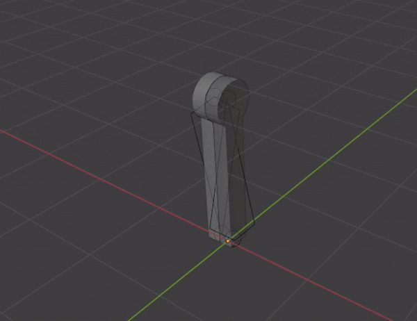
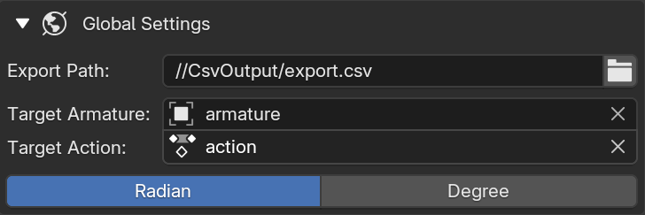
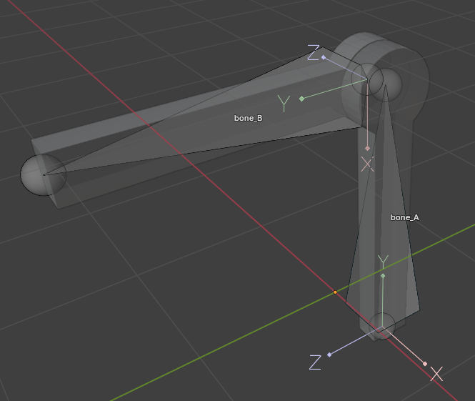
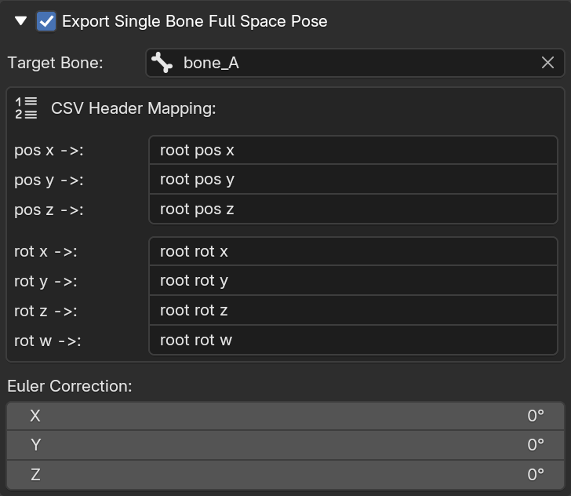
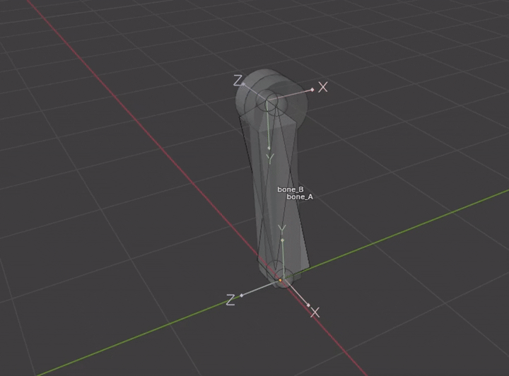
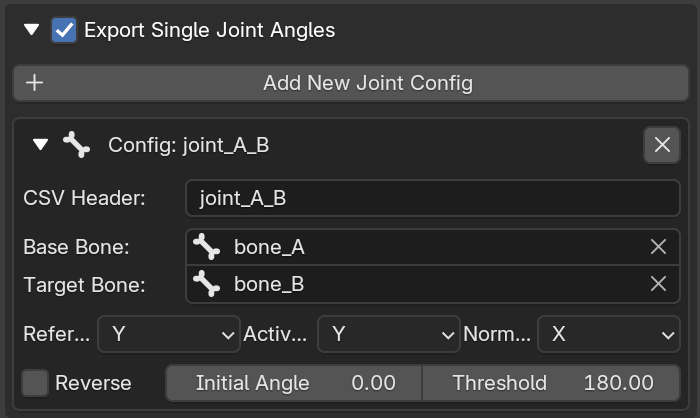

  🌍 <b>English</b> | <a href="example_zh.md">简体中文</a>

# Export Example

  

**Let's export this animation as a URDF joint angle sequence.**

  

1. First, configure the Export Path, Target Armature, Target Action, and Export Unit.

  

  

2. Next, configure the Single Bone Full Space Pose export settings. In this example, I bound the `base_link` mesh to `bone_A`, so I set `bone_A` as the Target Bone. In the Single Bone Full Space Pose export settings, only one bone needs to be configured because there is only one `base_link` in the URDF. The exported `pos` represents the coordinates of the `bone_A` root relative to the world origin. It is recommended to ensure that the origin of the bone corresponding to `base_link` aligns with the position of the `base_link` coordinate system on the robot in the URDF.

  

  

3. Then, create a new joint configuration. I named the CSV Header `joint_A_B`, selected `bone_A` as the Base Bone, and `bone_B` as the Target Bone. `bone_A` is the parent of `bone_B` (generally, the Base Bone is the parent of the Target Bone, but the plugin also works for two bones without a parent-child relationship). Select the `Y-axis` for both Reference i and Active j. As seen in the image above, the joint angle we actually want to export is the angle between the `Y-axis` of `bone_A` and the `Y-axis` of `bone_B`. The `Y-axis` selected for Reference i is the `Y-axis` of the Base Bone, and the `Y-axis` selected for Active j is the `Y-axis` of the Target Bone. The axis specified by Reference i will act as a stationary reference for the axis specified by Active j. The exported value is the angle between the `i-axis` and the `j-axis` projected onto the normal plane of Normal k (This angle is regarded as the user-specified **Initial Angle** in the static posture.). Rotating along the positive direction of Normal k results in a positive angle. Here, we select the `X-axis` for Normal k (referring to the `X-axis` of `bone_A`). We do not need to check Reverse here. If the axis selected for Normal k is opposite to the joint axis direction in your URDF, you will need to check Reverse. I set the Threshold to 180° here. In most cases, 180° is appropriate. If you notice that the angle sequence data in the exported CSV jumps from x° to -(360°-x°), you will need to adjust this threshold.

4. Finally, click the `Start Exporting CSV Sequence` button and wait for the export to complete.

👉 [Click here to view the exported data example](export.csv)