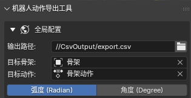
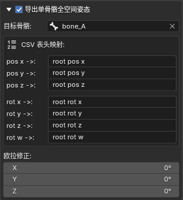
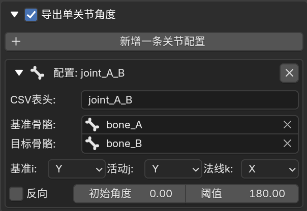

  🌍 <a href="example_en.md">English</a> | <b>简体中文</b>

# 导出案例

  

**让我们将该动画导出为urdf的关节角度序列。**

  

1.首先配置好导出路径、目标骨架、目标动作与导出单位。

  

  

2.其次配置单骨骼全空间姿态导出配置表格，在这个案例中，我将base_link的网格绑定到`bone_A`上，所以我将`bone_A`配置为目标骨骼，在单骨骼全空间姿态导出配置表格中，只需要配置一根骨骼，因为在urdf中只有一个base_link，导出的pos为`bone_A`骨骼相对于世界原点的坐标，建议使base_link对应骨骼的原点与urdf内base_link的坐标系在机器人上所处的位置一致。

  

  

3.然后新建一条关节配置,我将csv表头命名为了`joint_A_B`,基准骨骼选择`bone_A`,目标骨骼选择`bone_B`,`bone_A`为`bone_B`的父级(一般来说,基准骨骼为目标骨骼的父级,但该插件对于不为父子级的两根骨骼也有效),`基准i`和`活动j`都选择`Y轴`,从上面的图片中可以看到,我们其实要导出的关节夹角就是`bone_A`的`Y轴`和`bone_B`的`Y轴`之间的夹角,`基准i`选择的`Y轴`为`基准骨骼`的Y轴,`活动j`选择的`Y轴`为`目标骨骼`的`Y轴`,`基准i`所指定的轴会被`活动j`指定的轴作为静止参照,导出值为`i轴`与`j轴`投影到`法线k轴`的法平面上的夹角(该夹角在静止姿态时视为用户指定的 **初始角度** ),沿`法线k轴`正方向旋转为正角度;在这里`法线k`我们选择`X轴`(指`bone_A`的`X轴`),在这里我们不需要勾选反向,如果在你的urdf中,如果`法线k`选择的轴与你的urdf中joint轴方向相反,则需要勾选反向,这里我将阈值设置为了180°,在大多数情况下,180°是合适的,如果你发现导出的csv中的角度序列数据发生了从x°到-(360°-x°)的跳变,此时需要调整该阈值。

4.然后点击`开始导出CSV序列`按钮,等待导出完成即可。

👉 [点击这里查看导出的数据示例](export.csv)
