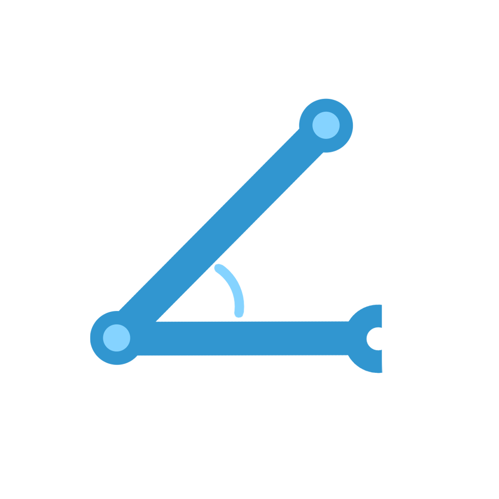
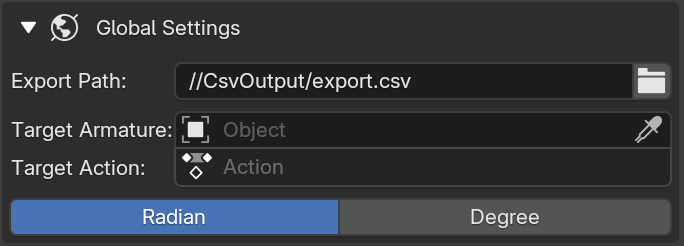
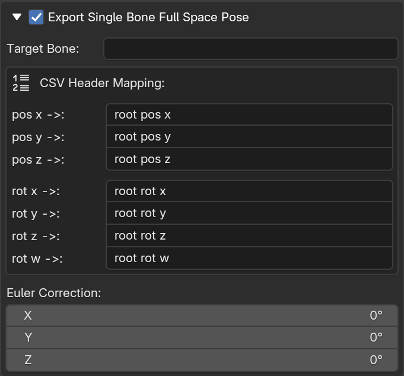
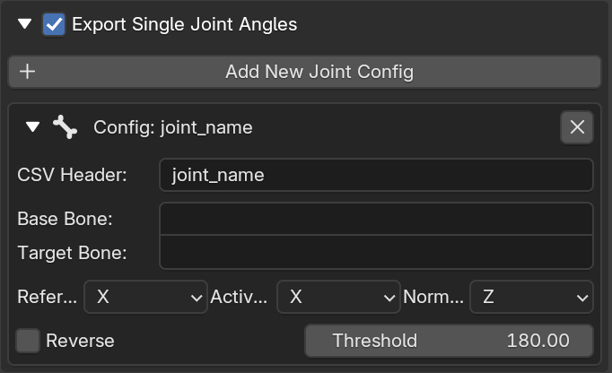

  

<h1 align="center">Pose2RoboAction</h1>

A Blender extension tool that directly maps CG animations to URDF joint sequences and exports them as CSV files.

  
  

  🌍 <b>English</b> | <a href="readme_zh.md">简体中文</a>

---

## 1. 📦 How to Install?

In Blender, go to **Edit** -> **Preferences** -> **Get Extensions** (or **Add-ons**) -> **Install from Disk...**, and select the plugin zip package `Pose2RoboAction.zip`. Once installed, you can find the **Pose2RoboAction** panel in the right-side toolbar (N-panel) of the 3D Viewport.

## 2. 🚀 Quick Start

Exporting an action sequence takes just three simple steps:

1. **Prepare Data**: Select the robot Armature with the bound actions in the 3D Viewport.
2. **Configure Parameters**:
   - In **Global Settings**, specify the export `.csv` file path, Target Armature, Target Action, and Export Unit.
   - Choose whether to enable "Export Single Bone Full Space Pose" and "Export Single Joint Angles" based on your needs.
   - Configure the specific mapping data for the full space pose and individual joints.
3. **One-Click Export**: Click the `Start Exporting CSV Sequence` button at the bottom of the panel.

## 3. ⚙️ Panel Parameters Guide

  

- **Export Path**: Defaults to `CsvOutput/export.csv` in the directory of the current `.blend` file.

- **Target Armature**: The armature used to export the URDF joint angle sequences, typically the armature bound to the robot.

- **Target Action**: Select the armature action to export. If your robot armature has multiple actions, you can specify the exact action to export here.
  
  

  
  

- **Target Bone (Root)**: Select the bone to export its full space state here, which is usually the single bone bound to `base_link`.

- **CSV Header Mapping**: The column headers for the corresponding exported data. `pos` represents the root coordinates of the target bone relative to the world origin, and `rot` represents its rotation relative to the world coordinate system.

- **Euler Correction**: If the axis of the bone corresponding to `base_link` is inconsistent with the `base_link` axis in the URDF, this can be resolved by adjusting the Euler Correction. This works identically to adjusting rotation in Pose Mode. During CSV export, this rotation is temporarily applied without permanently modifying the original `.blend` data.
  
  

  
  

- Click the **Add New Joint Config** button to create a new joint configuration. Each configuration created here corresponds to a single data column in the CSV, recording the angle sequence of a single URDF joint.

- **Base Bone**: Its coordinate system acts as the static reference coordinate system for the target bone. It is usually mapped to the Parent Link of the robot joint, providing a stationary reference for the target bone.

- **Target Bone**: Its coordinate system serves as the angle reference for the URDF joint. It is typically mapped to the Child Link of the robot, which is the bone whose pose changes under direct drive.

- **Reference i**: Select one axis of the Base Bone's coordinate system to serve as the stationary reference for **Active j**.

- **Active j**: Select one axis of the Target Bone's coordinate system to calculate its angle with **Reference i** serving as the stationary reference.

- **Normal k**: Select one axis of the Base Bone's coordinate system to determine the plane onto which **Reference i** and **Active j** will be projected. This plane is the normal plane of **Normal k**. The angle is calculated after projecting **Reference i** and **Active j** onto this plane.

- **Initial Angle**: Used to manually specify the absolute physical angle of the corresponding URDF joint on the real robot when the Blender armature is in its rest pose (Edit Mode). This value serves as the base zero-position offset for calculating the final absolute angle in the real world.

- **Reverse**: Used to control whether the output value is multiplied by $-1$.

- **Threshold**: The threshold to determine the forward/reverse rollover of the robot joint, defaulting to $180^\circ$. When the rotation angle exceeds this threshold, it will be remapped to a reverse rotation. (For example, if the threshold is set to $210^\circ$, when the joint angle is $200^\circ$ (Rest pose is considered $0^\circ$), the plugin exports it as $200^\circ$. If the angle exceeds the threshold, e.g., $300^\circ$, the plugin considers it as a reverse rotation of $60^\circ$ ($300^\circ - 360^\circ$) and exports it as $-60^\circ$).

---

### How is the Actual Export Value of a Single Joint Config Calculated?

The plugin calculates the single joint rotation angle in four main stages: **Vector Extraction**, **Planar Projection**, **Relative Delta Calculation**, and **Post-Processing**. Below is the complete mathematical logic of the underlying solver:

#### 1. Vector Extraction

The system first retrieves the world space transformation matrices of the Base Bone and Target Bone for the current frame. Based on the user-configured axes (X/Y/Z), it extracts three normalized 3D direction vectors:

- **Normal vector $\vec{k}$**: Extracted from the Base Bone, determining the plane of rotation (normal plane).
- **Reference vector $\vec{i}$**: Extracted from the Base Bone, acting as the stationary reference axis on this plane.
- **Active vector $\vec{j}$**: Extracted from the Target Bone, representing the actual posture pointer after rotation.

#### 2. Planar Projection & Angle Calculation

The system uses $\vec{k}$ as the normal to determine a 2D plane and projects $\vec{j}$ onto the $\vec{k}$ plane. $\vec{i}$ does not need to be projected because $\vec{i}$ and $\vec{k}$ originate from the same bone and are natively orthogonal. It then calculates the angle between the projected $\vec{j}$ and $\vec{i}$.

1. **Construct a local 2D coordinate system**:
   Using $\vec{i}$ as the X-axis, the Y-axis is obtained by the cross product of $\vec{k}$ and $\vec{i}$:

$$
\vec{u}_x = \vec{i}
$$

$$
\vec{u}_y = \vec{k} \times \vec{i}
$$

2. **Calculate projection coordinates**:
   Dot product the active vector $\vec{j}$ with the basis above to get its coordinates $(x, y)$ on the 2D plane:

$$
x = \vec{j} \cdot \vec{u}_x
$$

$$
y = \vec{j} \cdot \vec{u}_y
$$

3. **Solve the absolute angle**:
   Use the arctangent function to find the absolute angle $\theta$ in the current state, and map it to the $[0^\circ, 360^\circ)$ range:

$$
\theta = \text{atan2}(y, x)
$$

#### 3. Relative Delta Calculation

Before exporting, the system pre-calculates the initial angle $\theta_{\text{rest}}$ when the armature is in its rest pose. When iterating through the animation frames, it calculates the net displacement for each frame:

$$
\Delta\theta_{\text{blender}} = \theta_{\text{current}} - \theta_{\text{rest}}
$$

#### 4. URDF Angle Calculation & Post-Processing

In this stage, the system seamlessly maps the relative motion in Blender to the absolute angle in the real robot URDF coordinate system.

1. **Map Motion Direction**: 
   If "Reverse" is checked on the panel, it means the positive rotation direction of the URDF joint is opposite to that of Blender. The system only reverses the **motion delta**:

$$
\Delta\theta_{\text{move}} = -\Delta\theta_{\text{blender}}
$$

   *(If unchecked, then $\Delta\theta_{\text{move}} = \Delta\theta_{\text{blender}}$)*

2. **Calculate URDF Absolute Angle**:
   Add the above motion delta to the user-specified "Initial Angle" to calculate the absolute angle of the current joint in the real world:

$$
\theta_{\text{abs}} = \theta_{\text{offset}} + \Delta\theta_{\text{move}}
$$

3. **Normalization**:
   Use modulo operation to forcefully map and truncate the absolute angle into a positive single-circle range:

$$
\theta_{\text{norm}} = \theta_{\text{abs}} \pmod{360^\circ}
$$

4. **Real Physical Thresholding**:
   The angle at this point is the pure actual robot angle [$0^\circ$, $360^\circ$). Directly apply the user's rollover threshold based on this. When $\theta_{\text{norm}} > \text{Threshold}$, the system will automatically execute a rollover:

$$
\text{Final Angle} = \theta_{\text{norm}} - 360^\circ
$$

5. **Unit Conversion**:
   According to the global settings, the final degrees are either output directly or converted to radians and written to the CSV sequence.

---

👉 [Click here to view the exported data example](./example/example_en.md)