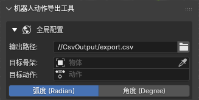
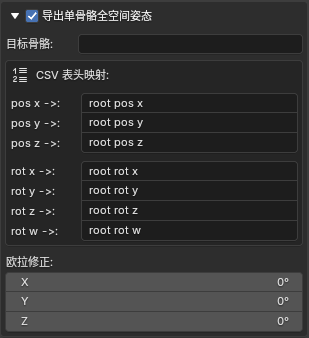
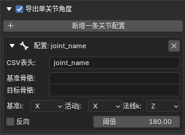

  

<h1 align="center">Pose2RoboAction</h1>

一款可以直接将 Blender 内 CG 动画映射为 URDF 关节序列并导出为 CSV 文件的扩展工具

  
  

  🌍 <a href="readme.md">English</a> | <b>简体中文</b>

---

## 1. 📦 如何安装？

在 Blender 内，进入 **编辑 (Edit)** -> **偏好设置 (Preferences)** -> **获取扩展 (Get Extensions)** -> **从磁盘安装... (Install from Disk...)**，选择本插件的压缩包 `Pose2RoboAction.zip`。安装完成后可在 3D 视图右侧工具栏 (N面板) 看到 **Pose2RoboAction** 栏目。

## 2. 🚀 快速入门

仅需三步即可完成一次动作序列的导出：

1. **准备数据**：在 3D 视图中选中你已经绑定好动作的机器人骨架。
2. **配置参数**：
   - 在 **全局配置** 中指定导出的 `.csv` 文件路径，目标骨架、目标动作以及导出单位。
   - 根据需求选择是否启用“导出单骨骼全空间姿态”以及“导出单关节角度”。
   - 配置单骨骼全空间姿态以及单关节角度的具体映射数据。
3. **一键导出**：点击面板底部的 `开始导出 CSV 序列` 按钮。

## 3. ⚙️ 面板参数详解

  

- **输出路径**：默认为当前 `.blend` 文件目录下的 `CsvOutput/export.csv`。

- **目标骨架**：用于导出 URDF 关节角度序列的骨架，通常为机器人绑定的骨架。

- **目标动作**：选择需要导出的骨架动作。如果你的机器人骨架存在多个动作，可在此处指定需要导出的特定动作。
  
  

  
  

- **目标骨骼 (Root)**：在此处选择需要导出全空间状态的骨骼，通常是为 `base_link` 绑定的单根骨骼。

- **CSV表头映射**：导出对应数据列的表头。`pos` 为目标骨骼根部相对世界原点的坐标，`rot` 为目标骨骼相对世界坐标系的旋转。

- **欧拉修正**：若 `base_link` 对应骨骼轴向与 URDF 里 `base_link` 轴向不一致，可通过调整欧拉修正解决。这与骨骼在姿态模式下的调整旋转的方式一致，在 CSV 导出时，会临时应用该旋转，而不会破坏 `.blend` 原始数据。
  
  

  
  

- 点击 **新增一条关节配置** 按钮来新建一个关节配置。此处新建的每个配置对应 CSV 的单个数据列，记录 URDF 单个关节的角度序列。

- **基准骨骼**：将其坐标系作为目标骨骼的静态参考坐标系。通常映射为机器人关节的父连杆 (Parent Link)，为目标骨骼提供静止参考。

- **目标骨骼**：将其坐标系作为 URDF 关节的角度参考。通常映射为机器人的子连杆 (Child Link)，即受直接驱动而发生位姿变化的骨骼。

- **基准 i**：选择基准骨骼坐标系的一个轴,作为**活动j**的静止参考。

- **活动j**：选择目标骨骼坐标系的一个轴,以**基准i**作为静止参考,计算角度。

- **法线k**：选择基准骨骼坐标系的一个轴,用于确定基准i与活动j投影的平面,该平面为**法线k**的法平面,将**基准i**与**活动j**投影到该平面后计算两者的角度。

- **反向**：用于控制是否将输出的值乘以$-1$。

- **阈值**：判断机器人关节正/反转翻转的阈值，默认为 $180^\circ$。当旋转角度超过该阈值时将被重映射为反方向旋转（例如将阈值设置为 $210^\circ$,当关节角度为 $200^\circ$ 时(静置姿态视为 $0^\circ$),插件将其视为 $200^\circ$ 导出,如果角度超过阈值,例如 $300^\circ$,则插件将其视为反方向旋转 $60^\circ$($300^\circ-360^\circ$)导出,即 $-60^\circ$）。

---

### 如何计算单条关节配置的实际导出值？

插件对于单关节旋转角度的解算，分为 **向量提取**、**平面投影**、**相对位移计算** 与 **数据后处理** 四个主要阶段。以下是底层解算的完整数学逻辑：

#### 1. 空间向量提取

系统首先获取当前帧下基准骨骼 (Base Bone) 和目标骨骼 (Target Bone) 的世界空间变换矩阵。根据用户配置的轴向（X/Y/Z），从中提取出三个标准化的三维方向向量：

- **法线向量 $\vec{k}$**：提取自基准骨骼，决定旋转平面（法平面）。
- **基准向量 $\vec{i}$**：提取自基准骨骼，作为该平面上的静止参考轴。
- **活动向量 $\vec{j}$**：提取自目标骨骼，表示实际转动后的姿态指针。

#### 2. 平面投影与角度解算

系统使用 $\vec{k}$ 作为法线，确定一个二维平面，并将 $\vec{j}$ 投影至 $\vec{k}$ 平面。$\vec{i}$ 无需投影，因为 $\vec{i}$ 与 $\vec{k}$ 来自同一骨骼，原生正交,随后计算投影后的 $\vec{j}$ 与 $\vec{i}$ 的夹角。

1. **构建局部二维坐标系**：
   使用 $\vec{i}$ 作为 X 轴，通过 $\vec{k}$ 和 $\vec{i}$ 的叉乘求得 Y 轴：

$$
\vec{u}_x = \vec{i}
$$

$$
\vec{u}_y = \vec{k} \times \vec{i}
$$

2. **计算投影坐标**：
   将活动向量 $\vec{j}$ 点乘上述基底，得到其在二维平面上的坐标 $(x, y)$：

$$
x = \vec{j} \cdot \vec{u}_x
$$

$$
y = \vec{j} \cdot \vec{u}_y
$$

3. **求解绝对角度**：
   利用反正切函数求得当前状态下的绝对夹角 $\theta$，并将其映射至 $[0^\circ, 360^\circ)$ 区间：

$$
\theta = \text{atan2}(y, x)
$$

#### 3. 相对位移计算

系统会在导出前，预先计算一遍骨架处于静止姿态时的初始夹角 $\theta_{\text{rest}}$。在遍历动画帧时，计算每一帧的净位移：

$$
\Delta\theta = \theta_{\text{current}} - \theta_{\text{rest}}
$$

#### 4. 数据后处理

1. **阈值重映射 (Thresholding)**：
   当 $\Delta\theta > \text{Threshold}$ 时，系统会自动执行：

$$
\Delta\theta = \Delta\theta - 360^\circ
$$

2. **反向**：
   如果勾选了“反向”，则：

$$
\Delta\theta = -\Delta\theta
$$

3. **单位转换**：
   根据全局设置，将度数直接输出，或转换为弧度写入 CSV 序列。

---

👉 [点击这里查看导出数据示例](./example/example_zh.md)